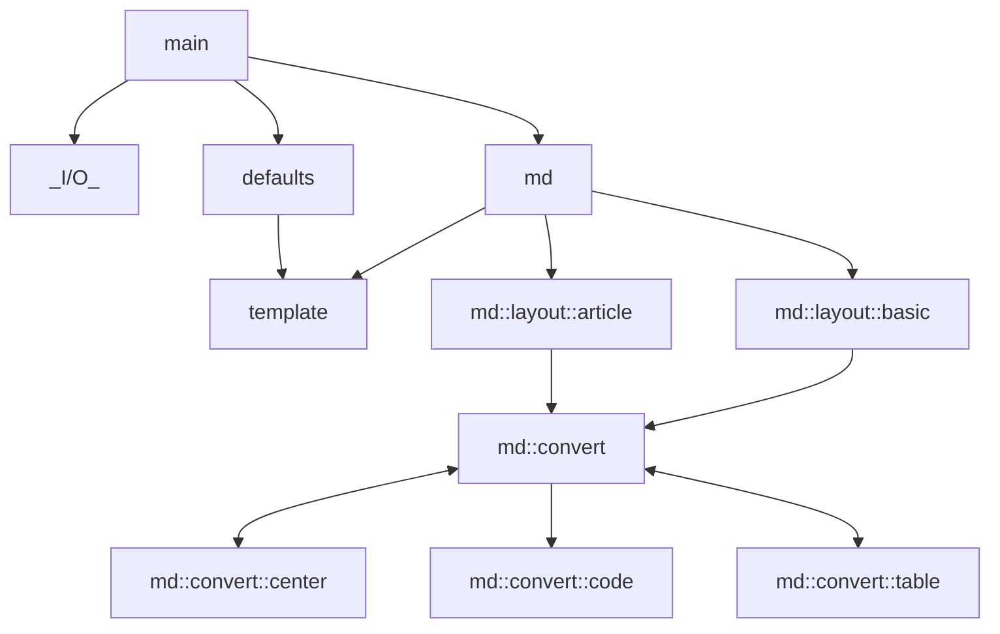

# Health

モジュール設計健康診断。

```mermaid
flowchart TD
    main --> _I/O_
    main --> md
    md --> template
    md --> md::layout::basic
    md --> md::layout::article
    md::layout::basic --> md::convert
    md::layout::article --> md::convert
    md::convert <--> md::convert::center
    md::convert --> md::convert::code
    md::convert <--> md::convert::table
    main --> defaults
    defaults --> template
```

> [!NOTE]
> `strutil`と`embedded`はグローバルなヘルパーオブジェクト群なので表示しない。
> また、I/Oレイヤーはモジュールではないが、`main`だけが担当していることを明示するために表示する。
